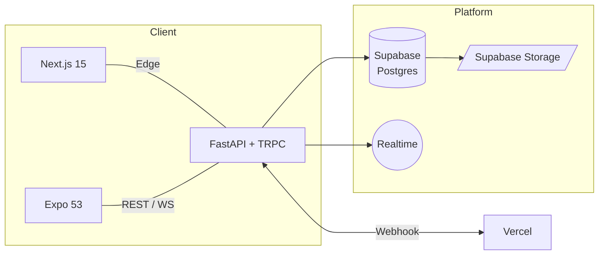

# ScaffAI ― 足場割付支援プラットフォーム
### *"120% 完成版" 要件定義書 — 2025-06-03*

---

## 1. 🎯 概要

**ScaffAI** は、足場事業者（個人事業主〜中小法人）が **"最短5分"** で自社案件の足場構成・見積・図面を作成できる **Web＋モバイル統合アプリ**。現場⇆事務所でリアルタイム同期し、"紙＋手計算" をゼロにします。

| 軸           | 内容 |
|--------------|------|
| **コア価値** | 作図 → 条件設定 → 足場計算 → 見積・図面出力をワンストップ |
| **差別化**   | 1. 軒の出・屋根形状を含む "現場ロジック" 内蔵<br>2. Web／現場アプリをシームレス同期<br>3. AI が最適構成＆見積を提案（Ver 2.0〜） |
| **技術基盤** | **Turborepo モノレポ + Next.js 15.1 + Expo SDK 53 + Supabase** |

---

## 2. 👥 ターゲット

| セグメント | ペルソナ / 課題 |
|------------|-----------------|
| **主** | **個人事業主（1〜3名）**<br>・現場と事務所を行き来し時間が足りない<br>・見積精度は経験頼り |
| **副** | **中小施工会社（5〜30名）**<br>・複数現場・複数担当の進捗が見えない<br>・作図や帳票がExcelで属人化 |

---

## 3. 🗺️ ユーザージャーニー

1. **案件登録** – 住所・階数・外壁PDF取込み
2. **作図 or DXF読込** – Webで壁線・屋根をトレース
3. **条件入力** – 軒の出・境界・屋根形状・特殊材
4. **ワンクリック計算** – 足場構成・離れ・段数・部材表を生成
5. **出力 & 共有** – PDF／DXF／モバイル連携
6. **現場フィードバック** – Mobileで確認／修正 → Webに即反映
7. **履歴 & アーカイブ** – プロジェクト単位に自動整理

---

## 4. 機能要件

### 4.1 作図 & 取込

| 機能 | 詳細 |
|------|------|
| **手描き作図** | Konva + snap grid、実寸表示、Undo/Redo（100 step） |
| **DXFレイヤー解析** | WALL / ROOF / OPENING 自動タグ付け、縮尺合わせ |
| **PDFベクタライズ** | 画像→ライン化、基準スケール設定、ノイズ除去 |

### 4.2 条件設定

- 軒の出：辺単位／一括、視覚エリア表示、既定600mm
- 境界線：左右／背面／前面、最低離れ値を動的マスク
- 特殊部材：355・300・150mm、および次世代足場910モジュール（Ver 1.1）

### 4.3 計算ロジック

| ステップ | アルゴリズム概要 |
|----------|-----------------|
| ① 基準割付 | 躯体長 ÷ 1800の切り捨て |
| ② 余長処理 | 余り + (軒の出+80)×2 → "最小オーバー構成" 探索 |
| ③ 入隅補正 | 二面共有パイプ除外、支柱スキップ *(Ver 1.1)* |
| ④ 屋根追従 | 勾配角度から高さ補正、横持ち認定 *(Ver 1.2)* |
| ⑤ AI提案 | コスト/安全/部材在庫を多目的最適化 *(Ver 2.0)* |

### 4.4 出力

- SVG / PNG / PDF（見積＋図面）
- DXF（Jw_cad互換, Shift-JIS）
- IFC / GDL（ArchiCAD）— *Ver 2.0*
- Web share target / QR deep link（Mobile共有）

---

## 5. 非機能要件 (NFR)

| カテゴリ | 目標値 |
|----------|--------|
| **性能** | FCP < 2s / API < 300ms / RN FPS 60 |
| **可用性** | 99.9%（月45min以下停止） |
| **セキュリティ** | OWASP Top 10準拠・JWT exp 30min・RLS 100% |
| **オフライン** | Expo-SQLiteキャッシュ／PWA ServiceWorker |
| **アクセシビリティ** | WCAG 2.1 AA |
| **国際化** | i18n-ready (en / ja) — *Ver 1.3* |

---

## 6. 技術スタック（アップデート版）

### 6.1 共通ツールチェーン

```yaml
turborepo: 2.3.0
pnpm: ^9.12.0
typescript: ^5.8.3
eslint: ^9.14.0   # Flat config
prettier: ^3.3.0
husky / lint-staged
```

### 6.2 Web (Next.js)

```yaml
nextjs: ^15.1.2
react / react-dom: 19.0.0
tailwindcss: 3.4.14
shadcn/ui: latest
radix-ui: 1.1.0
zustand: 5.0.1
tanstack-query: 5.59.16
konva / react-konva: 9.3.15 / 18.2.10
lucide-react: 0.475.0
```

### 6.3 Mobile (Expo)

```yaml
expo: ~53.0.9
react-native: 0.79.2
expo-router: ~5.0.7
nativewind: 4.1.23
react-native-reanimated: ~3.17.4
expo-camera: ~17.0.0
expo-haptics: ~14.0.0
expo-file-system: ~19.0.0
```

### 6.4 Backend

```yaml
supabase-js: 2.45.4
fastapi: 0.115.4  # Python 3.11
trpc: 10.45.2
openapi-typescript: 7.4.2
```

### 6.5 DevOps / QA

```yaml
github-actions + turborepo-remote-cache
vitest: 2.1.3
playwright: 1.48.2
maestro: latest
sentry: (web / mobile) + vercel analytics
```

---

## 7. データモデル（抜粋）

| エンティティ | 主キー | 主属性 |
|-------------|--------|-------|
| projects | id (uuid) | name / owner_id / site_address / created_at |
| drawings | id | project_id / dxf_blob / svg_blob / scale |
| conditions | id | project_id / eave_depths[] / boundaries / roof_type |
| calculations | id | project_id / algo_version / result_json / cost |
| users | id | email / role / plan / created_at |

---

## 8. アーキテクチャ図



---

## 9. リリース計画

| フェーズ | 期間 | マイルストーン |
|----------|------|---------------|
| MVP | 6w | 作図v1 + 計算v0.9 + Expo 53ビルド + Supabase Auth |
| v1.0 | +6w | DXF/PDF出力、課金開始、RLS完全化、CI 90%テスト |
| v1.5 | +3w | 入隅・屋根補正、Mobileオフライン同期 |
| v2.0 | +12w | AI提案、3D Export、ArchiCAD/IFC |

---

## 10. KPI / OKR

| 領域 | 指標 (Q3-2025) |
|------|---------------|
| UX | NPS ≥ +45、タスク完了 < 8min |
| Growth | 法人50社 / 個人300人 |
| MRR | ¥1.2M （有料転換20%） |
| 品質 | Crash-free 99.8% |
| 性能 | Lighthouse ≥ 92、API p95 250ms |

---

## 11. リスク & 対策

| リスク | 影響 | 対策 |
|--------|------|------|
| ライブラリ非互換 | ビルド不能 | expo doctor, next lint CI必須、patch-package |
| オフライン長時間 | 同期衝突 | CRDT-like diff、Supabase merge rules |
| 法改正 | ロジック陳腐化 | ADRでモジュール化、法改正時パッチ配信 |
| Realtime負荷 | レイテンシ増 | Supabase Region拡張 + PgBouncer |

---

## 12. ADR運用ルール

- `docs/adr/ADR-0001_expo53.md` などMarkdownでGit管理
- 決定 / 代替案 / トレードオフ / 再評価日 を必須記載
- CIで "ADR不在の破壊的変更" を検出しレビューブロック

---

## 13. 用語集（抜粋）

| 用語 | 意味 |
|------|------|
| 離れ | 建物外壁から足場支柱中心までの距離 |
| スパン | 足場パイプ1本の基準長1,800mm |
| 軒の出 | 壁外面から屋根先端までの水平距離 |
| IFC | Industry Foundation Classes — BIM標準フォーマット |